# QConnect Admin — User Flows and Screen Guide

This document explains what a Super Admin does in the QConnect Admin application. It is written as a product-flow guide: each module describes the user goal, the screens involved, the API/data path, and the expected result.

> GitHub renders the Mermaid diagrams below automatically. The HTML wireframes are intentionally simple so they remain readable in GitHub and other Markdown viewers.

## 1. Application map

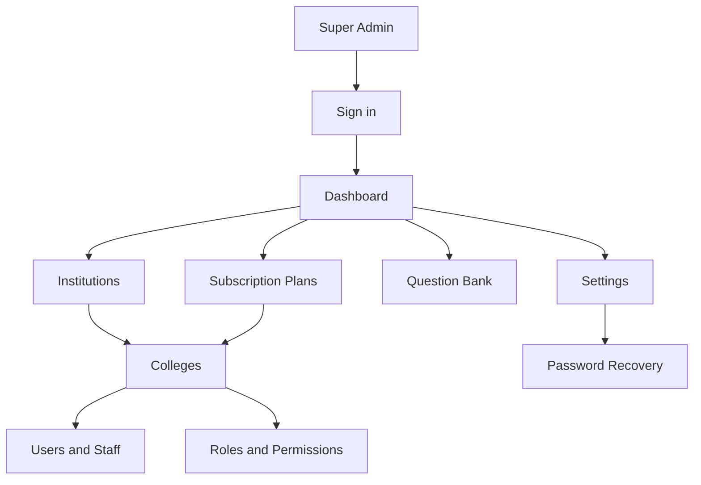

### Business hierarchy

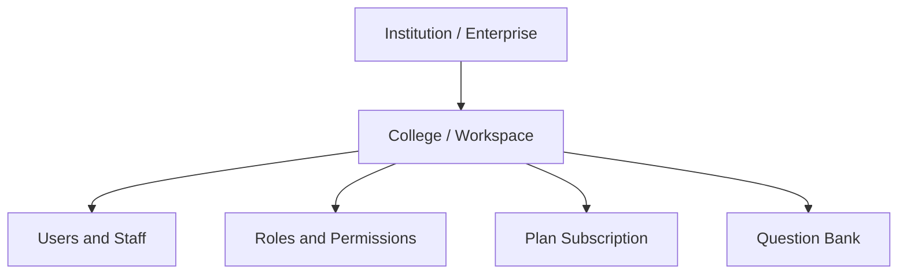

<table>
<tr><th>Layer</th><th>Purpose</th><th>Owner of the action</th></tr>
<tr><td>Authentication</td><td>Proves who the Admin is and creates a session.</td><td>Admin + Google/email</td></tr>
<tr><td>Institution</td><td>Top-level customer organization.</td><td>Super Admin</td></tr>
<tr><td>College</td><td>Workspace belonging to an institution.</td><td>Super Admin</td></tr>
<tr><td>Users/Roles</td><td>People and permissions inside a college.</td><td>Super Admin</td></tr>
<tr><td>Plans</td><td>Features, credits, and subscriptions assigned to colleges.</td><td>Super Admin</td></tr>
<tr><td>Questions</td><td>Shared general, MCQ, and coding content.</td><td>Super Admin</td></tr>
</table>

## 2. Sign in and session flow

### User goal

Sign in with Google or email/password, then open protected Admin pages.

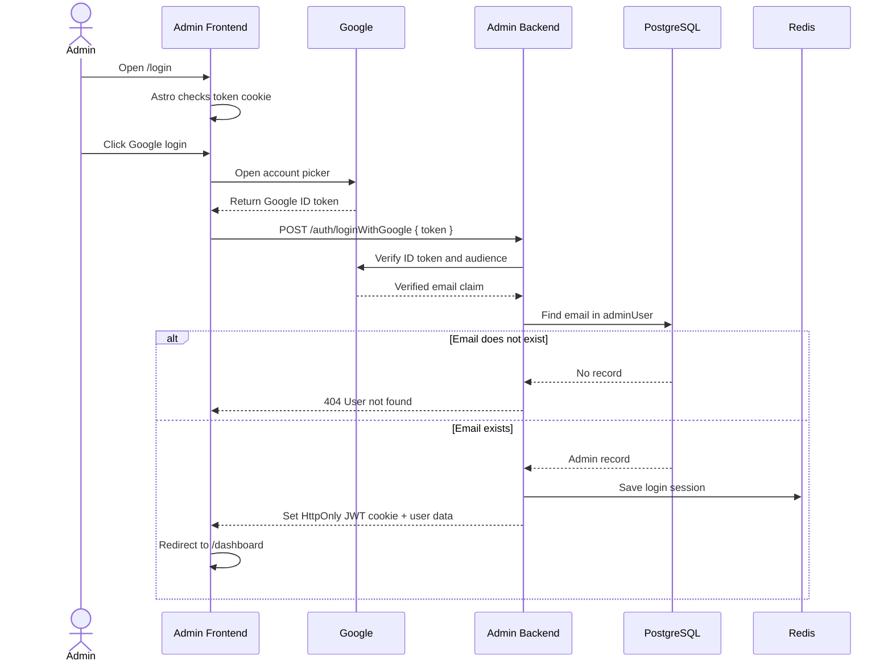

<table>
<tr><th>Screen wireframe</th><th>Functional behavior</th></tr>
<tr><td>
<pre>
┌────────────────────────────┐
│ QConnect Admin             │
│ Sign in to your account    │
│ [ Email                  ]  │
│ [ Password               ]  │
│ [ Sign in               ]   │
│ [ Continue with Google ]   │
│ Forgot password?           │
└────────────────────────────┘
</pre>
</td><td>Google returns an ID token to the browser. The browser sends only the token to the backend. The backend extracts the email, checks <code>adminUser</code>, creates the application JWT, and sets the cookie.</td></tr>
</table>

## 3. Institution management

### User goal

Create and maintain the top-level customer organization before adding colleges.

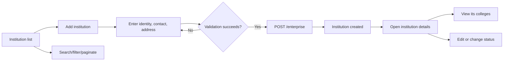

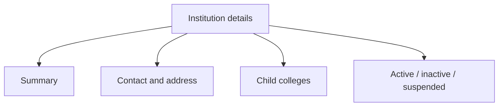

<pre>
┌─────────────────────────────────────────────────────────┐
│ Institutions                         [+ Add institution] │
│ [Search] [Status filter]                                  │
├──────────────┬─────────────┬──────────────┬──────────────┤
│ Name         │ Type        │ Status       │ Actions      │
│ ABC Group    │ University  │ ACTIVE       │ View Edit    │
└──────────────┴─────────────┴──────────────┴──────────────┘
</pre>

## 4. College management

### User goal

Add a college under an institution and maintain its accreditation, contact, and status information.

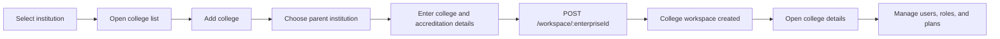

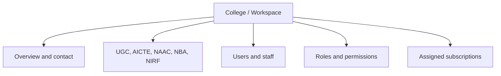

## 5. User and staff management

### User goal

Create people inside a college, connect them to a role, and control their status.

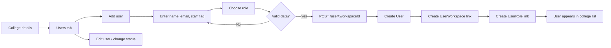

<pre>
┌─────────────────────────────────────────────────────────┐
│ College: ABC Engineering                 [ + Add user ]  │
│ [Search users] [Role filter] [Status filter]             │
├────────────┬──────────────────┬───────────┬─────────────┤
│ Name       │ Email            │ Role      │ Status      │
│ Priya Shah │ priya@abc.edu    │ Manager   │ ACTIVE      │
└────────────┴──────────────────┴───────────┴─────────────┘
</pre>

## 6. Roles and permissions

### User goal

Define what a college role can view, create, edit, or delete.

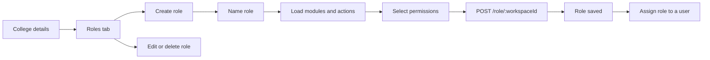

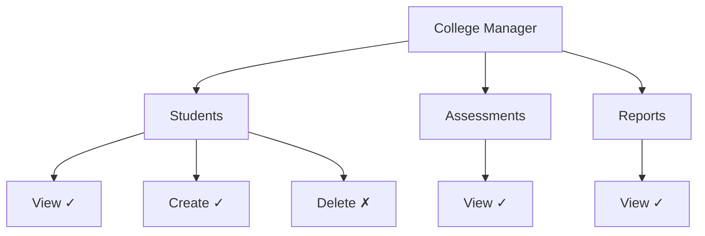

## 7. Subscription plans

### User goal

Create a product plan, configure its features, and assign it to a college for a date range.

```mermaid
flowchart LR
    A[Plans list] --> B[Add or edit plan]
    B --> C[Enter name, type, price]
    C --> D[Add feature identifiers and values]
    D --> E[POST or PUT /plans]
    E --> F[Plan saved]
    F --> G[Open plan details]
    G --> H[Assign college]
    H --> I[Select college and dates]
    I --> J[POST /plans/:id/workspaces]
    J --> K[Active subscription]
```

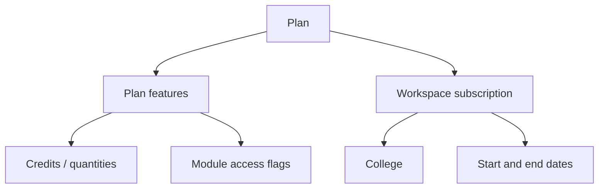

<pre>
┌─────────────────────────────────────────────────────────┐
│ Professional Plan                         [Assign college]│
│ Monthly: ₹___   Yearly: ₹___   Status: ACTIVE           │
├───────────────────────────┬─────────────────────────────┤
│ Feature                   │ Value                       │
│ Assessment attempts       │ 100                         │
│ Coding module             │ Enabled                     │
├───────────────────────────┴─────────────────────────────┤
│ Assigned colleges: ABC Engineering · 01 Jan–31 Dec       │
└─────────────────────────────────────────────────────────┘
</pre>

## 8. Question bank and authoring

### User goal

Create reusable general, MCQ, and coding questions with tags, companies, visibility, and test cases.

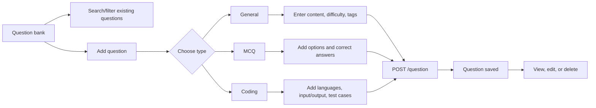

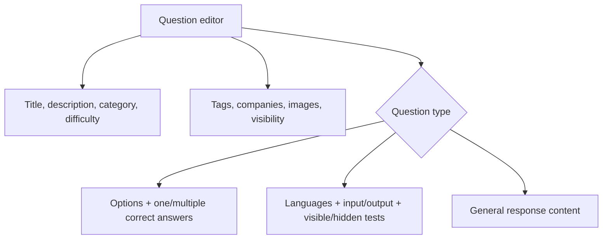

<pre>
┌─────────────────────────────────────────────────────────┐
│ Add question                                             │
│ Type: ( General ▼ )   Difficulty: ( Medium ▼ )           │
│ Title: [                                              ]  │
│ Description: [                                        ]   │
│ Tags: [arrays] [sorting]       Visibility: [Public ▼]   │
│                                                         │
│ Type-specific editor                                     │
│   MCQ:     [Option A] [✓ correct]                       │
│   Coding:  [Language] [Input] [Output] [+ Test case]    │
│                                                         │
│                         [Cancel] [Save question]        │
└─────────────────────────────────────────────────────────┘
</pre>

## 9. Settings and password recovery

```mermaid
flowchart LR
    A[Settings] --> B[Profile tab]
    B --> C[View profile]
    C --> D[Update phone]
    D --> E[PUT /auth/profile]
    A --> F[Password tab]
    F --> G[Request reset email]
    G --> H[/forgot-password]
    H --> I[Validate reset token]
    I --> J[/set-password]
    J --> K[Save new bcrypt password]
    K --> L[Return to /login]
```

## 10. Dashboard, reports, contact, and utilities

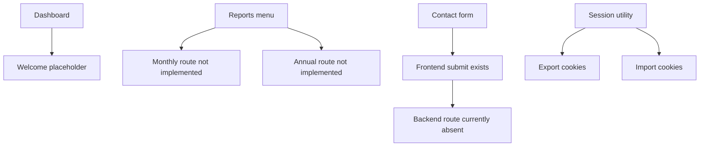

| Module | Current user experience | Current status |
|---|---|---|
| Dashboard | Protected landing page with welcome content. | Placeholder |
| Reports | Navigation links exist, but report pages/APIs are absent. | Not implemented |
| Contact | Form exists, but the Admin Backend route is absent. | Partial/broken |
| Session import/export | Support utility for moving cookie/session information. | Internal utility |

## 11. End-to-end example: onboard a new college

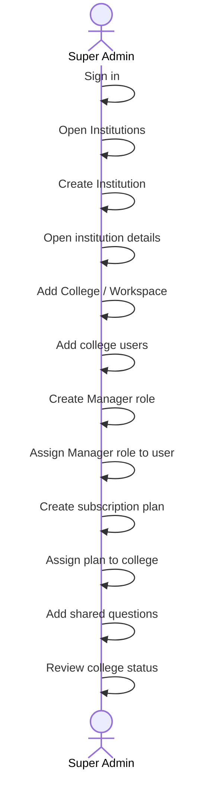

### Completion checklist

- [ ] Admin account exists in `adminUser`.
- [ ] Institution is created and active.
- [ ] College is created under the institution.
- [ ] Initial users are added to the college.
- [ ] Roles and permissions are configured.
- [ ] A plan is assigned with valid start/end dates.
- [ ] Required questions are created or reviewed.
- [ ] The college can proceed with its configured access.

## 12. Source map

| Area | Frontend | Backend |
|---|---|---|
| Authentication | `Admin-Frontend/src/pages/login.astro`, `src/components/signin/Login.tsx` | `Admin-Backend/src/api/auth/` |
| Institutions | `Admin-Frontend/src/pages/manageInstitution/` | `Admin-Backend/src/api/enterprise/` |
| Colleges | `Admin-Frontend/src/pages/manageColleges/` | `Admin-Backend/src/api/workspace/` |
| Users | `Admin-Frontend/src/components/manageColleges/` | `Admin-Backend/src/api/user/` |
| Roles | College detail role components | `Admin-Backend/src/api/role/` |
| Plans | `Admin-Frontend/src/pages/managePlans/` | `Admin-Backend/src/api/plans/` |
| Questions | `Admin-Frontend/src/pages/manageQuestions/` | `Admin-Backend/src/api/question/` |

