# FC Labs Admin — User Flows and Screen Guide

This document explains what a Super Admin does in the FC Labs Admin application. It also records the QConnect-to-FC-Labs migration so the removed Institution layer and the new learning-operations modules are easy to compare.

> GitHub renders the Mermaid diagrams below automatically. The HTML wireframes are intentionally simple so they remain readable in GitHub and other Markdown viewers.

## 1. Application map

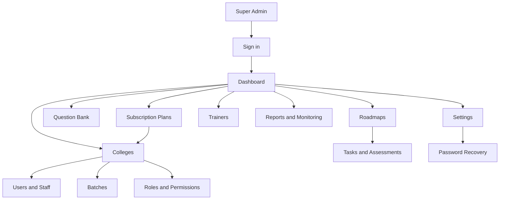

### Business hierarchy

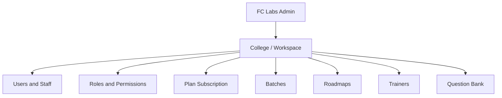

<table>
<tr><th>Layer</th><th>Purpose</th><th>Owner of the action</th></tr>
<tr><td>Authentication</td><td>Proves who the Admin is and creates a session.</td><td>Admin + Google/email</td></tr>
<tr><td>College</td><td>Top-level customer organization; backend name: Workspace.</td><td>Super Admin</td></tr>
<tr><td>Users/Roles</td><td>People and permissions inside a college.</td><td>Super Admin</td></tr>
<tr><td>Batches</td><td>Groups of students used for roadmap delivery.</td><td>Super Admin</td></tr>
<tr><td>Plans</td><td>Features, credits, and subscriptions assigned to colleges.</td><td>Super Admin</td></tr>
<tr><td>Roadmaps/Trainers</td><td>Learning journeys, delivery ownership, tasks, and assessments.</td><td>Admin + Trainer</td></tr>
<tr><td>Questions</td><td>Shared general, MCQ, and coding content used by assessments.</td><td>Admin + Trainer</td></tr>
</table>

## 2. Sign in and session flow

### User goal

Sign in with Google or email/password, then open protected Admin pages.

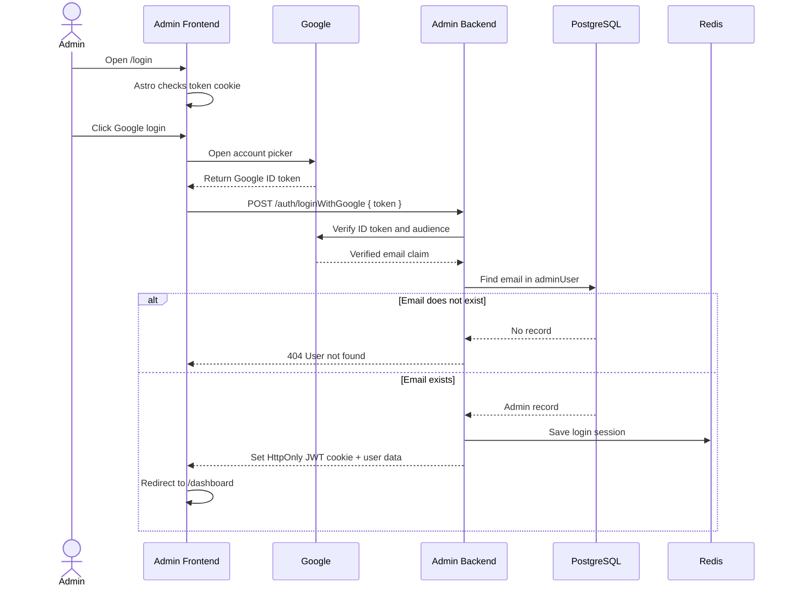

<table>
<tr><th>Screen wireframe</th><th>Functional behavior</th></tr>
<tr><td>
<pre>
┌────────────────────────────┐
│ FC Labs Admin              │
│ Sign in to your account    │
│ [ Email                  ]  │
│ [ Password               ]  │
│ [ Sign in               ]   │
│ [ Continue with Google ]   │
│ Forgot password?           │
└────────────────────────────┘
</pre>
</td><td>Google returns an ID token to the browser. The browser sends only the token to the backend. The backend extracts the email, checks <code>adminUser</code>, creates the application JWT, and sets the cookie.</td></tr>
</table>

## 3. Legacy QConnect institution flow (removed in FC Labs)

### User goal

In QConnect, the Admin created an Institution/Enterprise first and then added colleges below it. FC Labs removes this step: the Admin creates a College/Workspace directly. The flow remains here only to make the migration explicit.

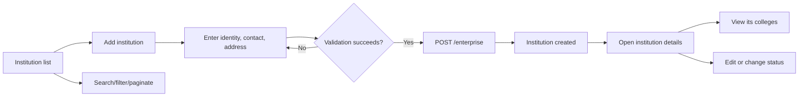

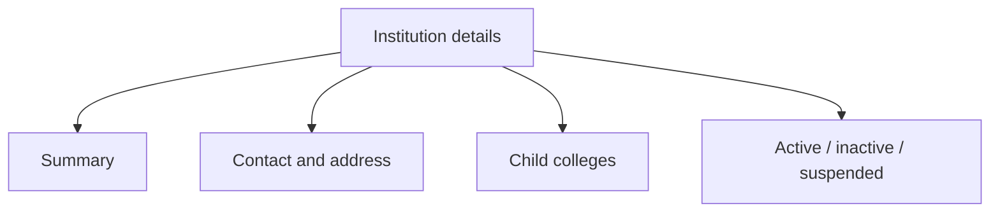

<pre>
┌─────────────────────────────────────────────────────────┐
│ Institutions                         [+ Add institution] │
│ [Search] [Status filter]                                  │
├──────────────┬─────────────┬──────────────┬──────────────┤
│ Name         │ Type        │ Status       │ Actions      │
│ ABC Group    │ University  │ ACTIVE       │ View Edit    │
└──────────────┴─────────────┴──────────────┴──────────────┘
</pre>

## 4. College management (FC Labs primary organization)

### User goal

Add and maintain a college directly. There is no Institution/Enterprise parent step in FC Labs.

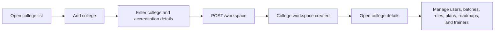

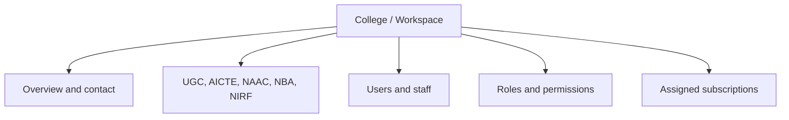

## 5. User and staff management

### User goal

Create people inside a college, connect them to a role, and control their status.

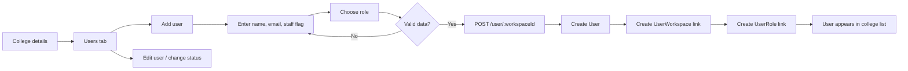

<pre>
┌─────────────────────────────────────────────────────────┐
│ College: ABC Engineering                 [ + Add user ]  │
│ [Search users] [Role filter] [Status filter]             │
├────────────┬──────────────────┬───────────┬─────────────┤
│ Name       │ Email            │ Role      │ Status      │
│ Priya Shah │ priya@abc.edu    │ Manager   │ ACTIVE      │
└────────────┴──────────────────┴───────────┴─────────────┘
</pre>

## 6. Roles and permissions

### User goal

Define what a college role can view, create, edit, or delete.

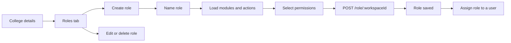

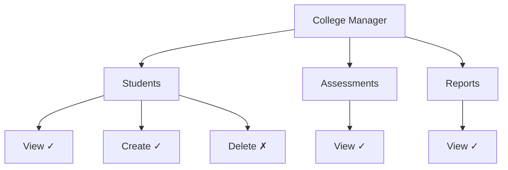

## 7. Subscription plans

### User goal

Create a product plan, configure its features, and assign it to a college for a date range.

```mermaid
flowchart LR
    A[Plans list] --> B[Add or edit plan]
    B --> C[Enter name, type, price]
    C --> D[Add feature identifiers and values]
    D --> E[POST or PUT /plans]
    E --> F[Plan saved]
    F --> G[Open plan details]
    G --> H[Assign college]
    H --> I[Select college and dates]
    I --> J[POST /plans/:id/workspaces]
    J --> K[Active subscription]
```

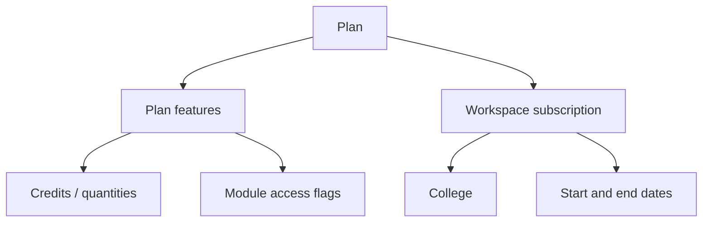

<pre>
┌─────────────────────────────────────────────────────────┐
│ Professional Plan                         [Assign college]│
│ Monthly: ₹___   Yearly: ₹___   Status: ACTIVE           │
├───────────────────────────┬─────────────────────────────┤
│ Feature                   │ Value                       │
│ Assessment attempts       │ 100                         │
│ Coding module             │ Enabled                     │
├───────────────────────────┴─────────────────────────────┤
│ Assigned colleges: ABC Engineering · 01 Jan–31 Dec       │
└─────────────────────────────────────────────────────────┘
</pre>

## 8. Question bank and authoring

### User goal

Create reusable general, MCQ, and coding questions with tags, companies, visibility, and test cases.

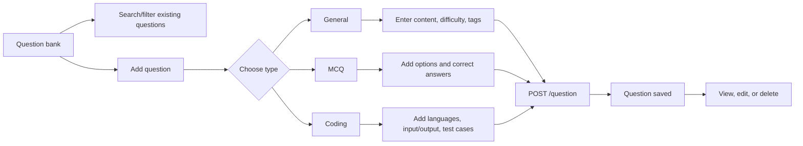

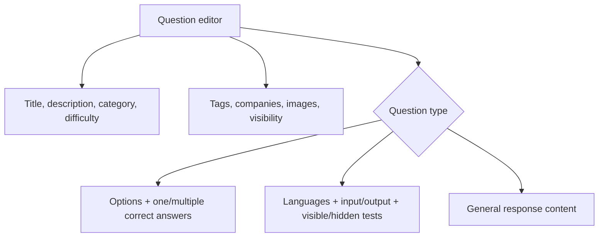

<pre>
┌─────────────────────────────────────────────────────────┐
│ Add question                                             │
│ Type: ( General ▼ )   Difficulty: ( Medium ▼ )           │
│ Title: [                                              ]  │
│ Description: [                                        ]   │
│ Tags: [arrays] [sorting]       Visibility: [Public ▼]   │
│                                                         │
│ Type-specific editor                                     │
│   MCQ:     [Option A] [✓ correct]                       │
│   Coding:  [Language] [Input] [Output] [+ Test case]    │
│                                                         │
│                         [Cancel] [Save question]        │
└─────────────────────────────────────────────────────────┘
</pre>

## 9. Settings and password recovery

```mermaid
flowchart LR
    A[Settings] --> B[Profile tab]
    B --> C[View profile]
    C --> D[Update phone]
    D --> E[PUT /auth/profile]
    A --> F[Password tab]
    F --> G[Request reset email]
    G --> H[/forgot-password]
    H --> I[Validate reset token]
    I --> J[/set-password]
    J --> K[Save new bcrypt password]
    K --> L[Return to /login]
```

## 10. Dashboard, reports, contact, and utilities

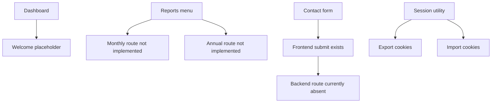

| Module | Current user experience | Current status |
|---|---|---|
| Dashboard | Protected landing page with welcome content. | Placeholder |
| Reports | Navigation links exist, but report pages/APIs are absent. | Not implemented |
| Contact | Form exists, but the Admin Backend route is absent. | Partial/broken |
| Session import/export | Support utility for moving cookie/session information. | Internal utility |

## 11. End-to-end example: onboard a new college

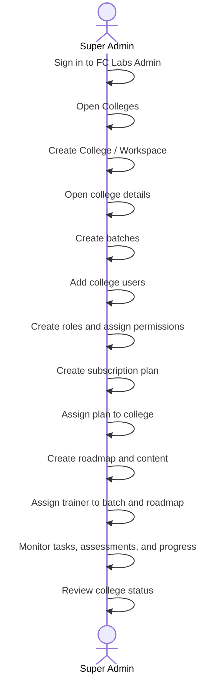

### Completion checklist

- [ ] Admin account exists in `adminUser`.
- [ ] College is created and active.
- [ ] Initial users are added to the college.
- [ ] Batches are created and students are assigned.
- [ ] Roles and permissions are configured.
- [ ] A plan is assigned with valid start/end dates.
- [ ] Roadmaps, trainers, tasks, and assessments are configured.
- [ ] Required questions are created or reviewed.
- [ ] The college can proceed with its configured access.

## 12. Source map

| Area | Frontend | Backend |
|---|---|---|
| Authentication | `Admin-Frontend/src/pages/login.astro`, `src/components/signin/Login.tsx` | `Admin-Backend/src/api/auth/` |
| Institutions | `Admin-Frontend/src/pages/manageInstitution/` | `Admin-Backend/src/api/enterprise/` |
| Colleges | `Admin-Frontend/src/pages/manageColleges/` | `Admin-Backend/src/api/workspace/` |
| Users | `Admin-Frontend/src/components/manageColleges/` | `Admin-Backend/src/api/user/` |
| Roles | College detail role components | `Admin-Backend/src/api/role/` |
| Plans | `Admin-Frontend/src/pages/managePlans/` | `Admin-Backend/src/api/plans/` |
| Questions | `Admin-Frontend/src/pages/manageQuestions/` | `Admin-Backend/src/api/question/` |

---

# FC Labs evolution from QConnect

The original QConnect Admin application manages institutions, colleges, users, roles, plans, questions, and Admin settings. The FC Labs version changes the organization model: the Institution/Enterprise level is removed and College/Workspace becomes the top-level organization.

## QConnect versus FC Labs

| Capability | Existing QConnect Admin | New FC Labs Admin |
|---|---|---|
| Top-level organization | Institution (`Enterprise`) | College (`Workspace`) |
| College relationship | A college belongs to an institution | A college is managed directly by FC Labs |
| Users and roles | Belong to a college/workspace | Still belong to a college/workspace |
| Batches | Not a primary Admin workflow | Core entity for grouping students |
| Subscription plans | Create plans and assign them to colleges | Same capability, now college-first |
| Question bank | Shared general, MCQ, and coding questions | Same capability, with roadmap-linked tasks and assessments |
| Roadmaps | Not available | Create, assign, monitor, and report roadmap progress |
| Trainers | Not available | Create, assign, track visits, activity, and performance |
| Assessments and tasks | Question-authoring capability exists | Trainers create and monitor them from roadmap/batch context |
| Student progress | Limited in the Admin scope | Chapter, topic, task, assessment, batch, and roadmap progress |
| Dashboard | Welcome placeholder | Multi-college, trainer, student, assessment, task, and roadmap metrics |
| Reports | Monthly/annual routes are not implemented | Required for college, trainer, roadmap, and student monitoring |
| Branding | QConnect labels and URLs | FC Labs labels, URLs, and product language |
| Authorization | Fine-grained enforcement is incomplete | Add Admin, Trainer, and other restricted roles |

## Organization model comparison

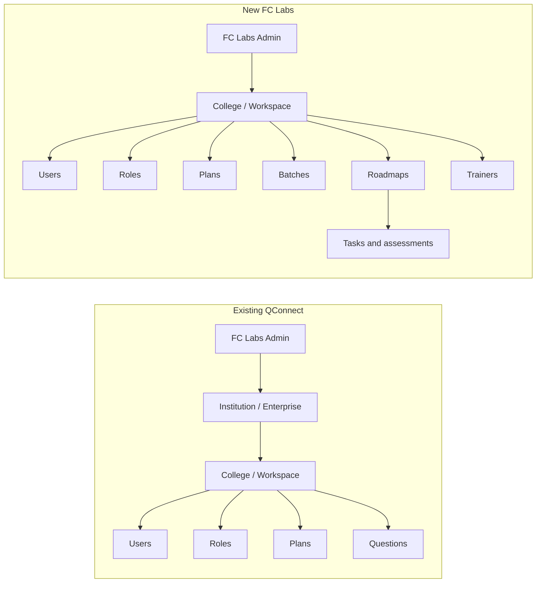

## FC Labs target hierarchy

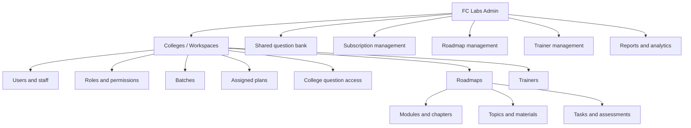

## 13. FC Labs college-first onboarding flow

### User goal

Onboard a college directly, create its student groups, and prepare learning delivery without an Institution/Enterprise step.

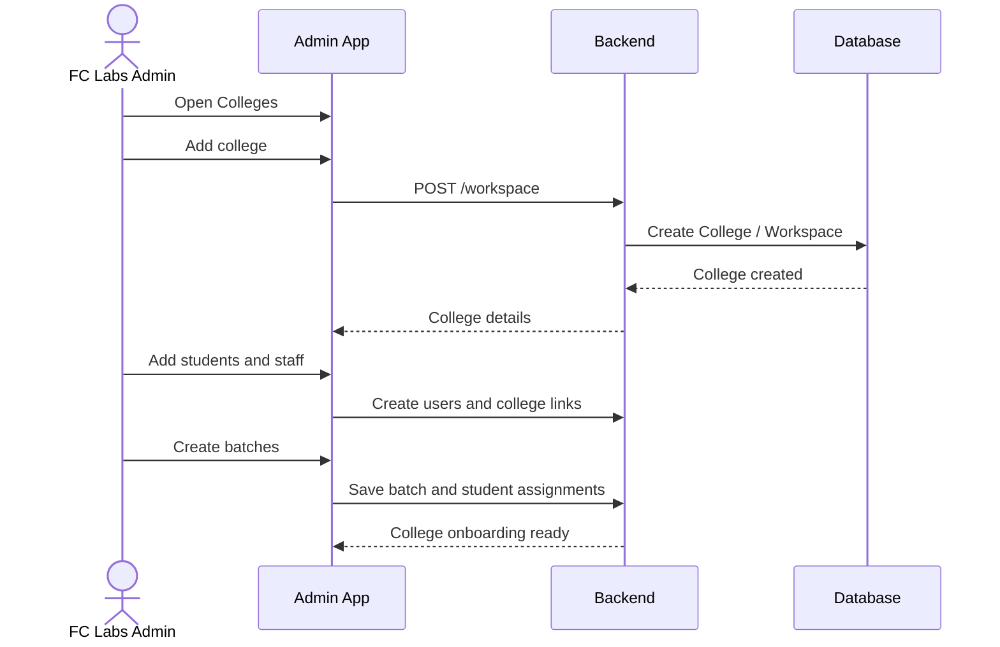

```mermaid
flowchart LR
    A[College list] --> B[Add college]
    B --> C[Save college details]
    C --> D[Create student users]
    D --> E[Create batches]
    E --> F[Assign students to batches]
    F --> G[Create roadmap assignments]
    G --> H[Assign trainers]
    H --> I[College ready for delivery]
```

<pre>
┌──────────────────────────────────────────────────────────────┐
│ FC Labs · Colleges                         [ + Add college ]   │
├───────────────┬──────────────┬───────────┬────────────────────┤
│ College       │ Batches      │ Students  │ Actions            │
│ ABC College   │ 4            │ 240       │ View · Edit        │
├───────────────┴──────────────┴───────────┴────────────────────┤
│ College details: Users | Batches | Roadmaps | Trainers | Plans │
└──────────────────────────────────────────────────────────────┘
</pre>

## 14. Batch management flow

### User goal

Divide a large college cohort into manageable groups before assigning roadmaps and trainers.

```mermaid
flowchart TD
    C[College] --> B1[Batch 1]
    C --> B2[Batch 2]
    C --> B3[Batch 3]
    C --> B4[Batch 4]
    B1 --> S1[Assigned students]
    B2 --> S2[Assigned students]
    B3 --> S3[Assigned students]
    B4 --> S4[Assigned students]
    B1 --> R1[Roadmap 1]
    B2 --> R2[Roadmap 2]
    B3 --> R3[Roadmap 3]
    B4 --> R4[Roadmap 4]
```

```mermaid
flowchart LR
    A[Open college] --> B[Batches tab]
    B --> C[Create batch]
    C --> D[Name batch and set schedule]
    D --> E[Select or import students]
    E --> F[Save batch]
    F --> G[Assign roadmap and trainer]
```

## 15. Roadmap management flow

### User goal

Build a learning journey for a batch, including content, deadlines, tasks, assessments, and completion tracking.

```mermaid
flowchart LR
    A[Roadmaps] --> B[Create roadmap]
    B --> C[Add modules]
    C --> D[Add chapters and topics]
    D --> E[Attach materials]
    E --> F[Add tasks and assessments]
    F --> G[Set deadlines]
    G --> H[Assign roadmap to batch]
    H --> I[Assign trainer]
    I --> J[Publish roadmap]
    J --> K[Monitor progress]
```

```mermaid
flowchart TD
    R[Roadmap]
    R --> M1[Module 1]
    R --> M2[Module 2]
    M1 --> C1[Chapter 1]
    M1 --> C2[Chapter 2]
    C1 --> T1[Topic + learning material]
    C2 --> T2[Topic + learning material]
    T1 --> A1[Task]
    T2 --> A2[Assessment]
    A1 --> P1[Submission and review]
    A2 --> P2[Attempt and result]
```

<pre>
┌──────────────────────────────────────────────────────────────┐
│ Roadmap: Full Stack Foundations              [Publish]        │
├──────────────────────────────────────────────────────────────┤
│ Module 1 · Web basics                         80% complete     │
│   ✓ Chapter 1 · HTML                           100%            │
│   ✓ Chapter 2 · CSS                            100%            │
│   ○ Chapter 3 · JavaScript                      40%            │
│ Module 2 · Backend                              0%             │
│                                                              │
│ Assigned: Batch 1 · Trainer: Trainer A · Deadline: 30 Jun    │
└──────────────────────────────────────────────────────────────┘
</pre>

## 16. Trainer management and tracking flow

### User goal

Allocate trainers to colleges, batches, and roadmaps, then monitor their delivery activity.

```mermaid
flowchart LR
    A[Trainers] --> B[Add trainer]
    B --> C[Enter profile and skills]
    C --> D[Activate trainer]
    D --> E[Assign college]
    E --> F[Assign batch]
    F --> G[Assign roadmap]
    G --> H[Trainer logs in with Trainer role]
    H --> I[Updates topics and chapters]
    I --> J[Creates tasks and assessments]
    J --> K[Reviews submissions]
    K --> L[Admin monitors activity and performance]
```

```mermaid
flowchart TD
    T[Trainer profile]
    T --> A[Current college]
    T --> V[Visited colleges]
    T --> B[Assigned batches]
    T --> R[Active roadmaps]
    T --> C[Completed roadmaps]
    T --> AS[Assessments created]
    T --> TA[Tasks created]
    T --> ST[Students trained]
    T --> PR[Progress and performance]
```

<pre>
┌──────────────────────────────────────────────────────────────┐
│ Trainer: Trainer A                              Status ACTIVE  │
├─────────────────────┬────────────────────────────────────────┤
│ Current college     │ ABC College                            │
│ Assigned batches    │ Batch 1, Batch 3                       │
│ Active roadmaps     │ Full Stack Foundations                  │
│ Students trained    │ 120                                     │
│ Assessments/tasks   │ 8 assessments · 14 tasks                │
├─────────────────────┴────────────────────────────────────────┤
│ Activity: topics taught · chapters completed · college visits │
└──────────────────────────────────────────────────────────────┘
</pre>

## 17. Role-based application access

```mermaid
flowchart TD
    L[Login] --> D{Role}
    D -->|FC Labs Admin| A[All colleges, plans, roadmaps, trainers, reports]
    D -->|Trainer| T[Assigned colleges, batches, roadmaps, tasks, assessments, progress]
    D -->|Student| S[User application: assigned roadmap, tasks, assessments, own progress]
```

| Role | Application | Main responsibilities |
|---|---|---|
| FC Labs Admin | Admin application | Create colleges, batches, roadmaps, plans, trainers; monitor delivery and outcomes. |
| Trainer | Admin application | Work only with assigned colleges/batches/roadmaps; teach topics; create assessments/tasks; review submissions. |
| Student | User application | View assigned roadmap; complete topics; attend assessments; submit tasks; track personal progress. |

## 18. Student delivery and monitoring flow

```mermaid
sequenceDiagram
    actor T as Trainer
    actor S as Student
    participant U as User App
    participant B as Backend
    participant A as Admin App

    T->>B: Mark topic/chapter complete
    B-->>U: Update assigned roadmap progress
    S->>U: Open roadmap
    U-->>S: Show completed and pending content
    T->>B: Create task or assessment
    B-->>U: Publish task/assessment to batch
    S->>U: Submit task / attend assessment
    U->>B: Save submission/result
    B-->>A: Update batch, student, and roadmap metrics
    A-->>A: Admin reviews trainer and completion dashboards
```

## 19. FC Labs implementation priorities

| Priority | Workstream | Required outcome |
|---:|---|---|
| 1 | Organization migration | Remove Institution/Enterprise dependencies and make Workspace/College primary. |
| 2 | Batch management | Create batches and assign students to batches. |
| 3 | Roadmaps | Build roadmap content, assignment, publishing, deadlines, and progress tracking. |
| 4 | Trainers | Add Trainer role, profiles, allocations, visits, activity, and performance. |
| 5 | Delivery objects | Link tasks and assessments to roadmap, chapter, topic, batch, and trainer. |
| 6 | Monitoring | Add student, batch, trainer, college, and roadmap dashboards. |
| 7 | Reports | Add monthly/annual and operational reports. |
| 8 | Security | Complete role/module authorization and environment-aware OAuth cookies. |
| 9 | Product migration | Replace QConnect branding, URLs, labels, and content with FC Labs. |

## 20. Final FC Labs operating model

```mermaid
flowchart TB
    A[FC Labs Admin] --> C[College]
    C --> B[Batches]
    B --> S[Students]
    C --> R[Roadmap]
    R --> M[Modules, chapters, topics]
    M --> TA[Tasks and assessments]
    C --> T[Trainer]
    T --> R
    S --> U[User application]
    U --> P[Submissions and progress]
    P --> X[Admin monitoring and reports]
    T --> X
```

FC Labs therefore moves from an institution-first administration model to a college-first learning-operations model. The new value is the complete delivery loop: college onboarding → batch creation → roadmap assignment → trainer delivery → student activity → task/assessment results → progress and performance reporting.
